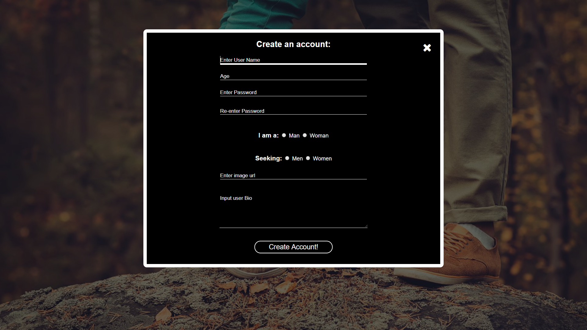
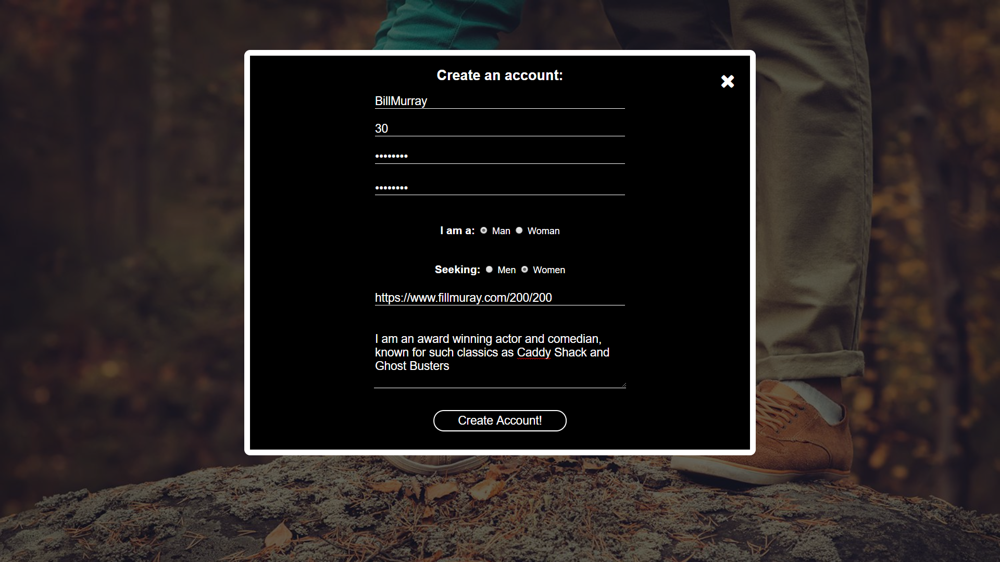
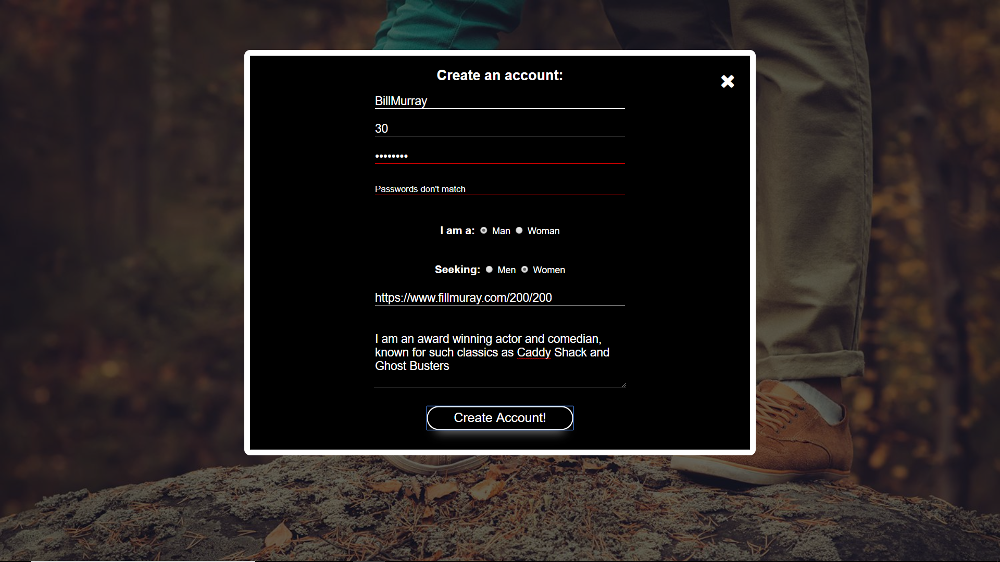
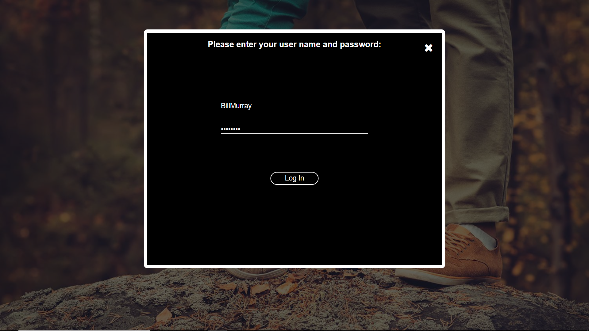
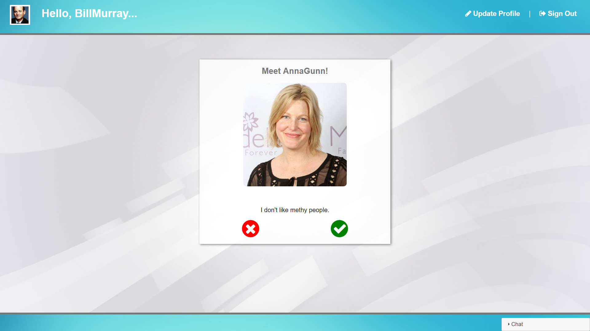
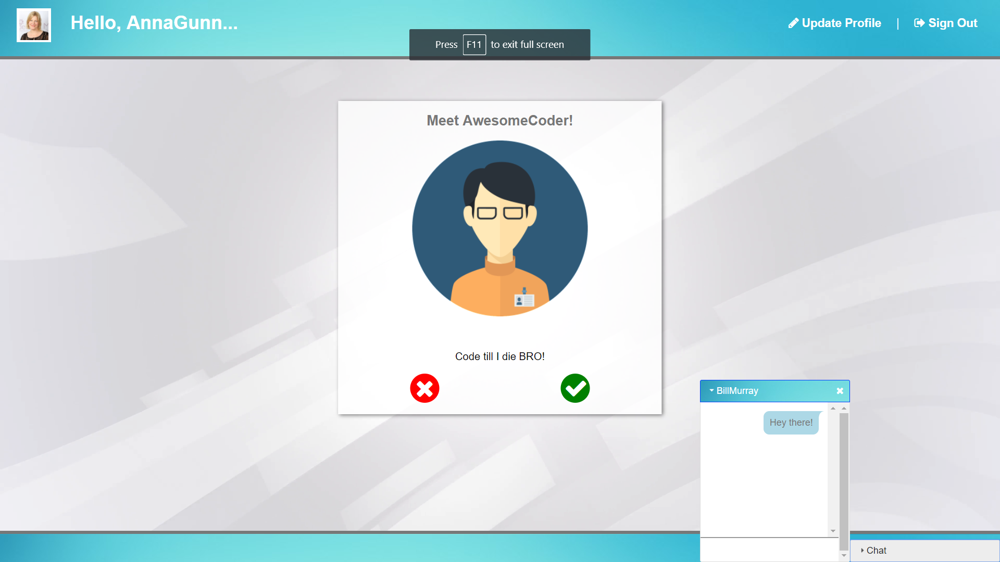
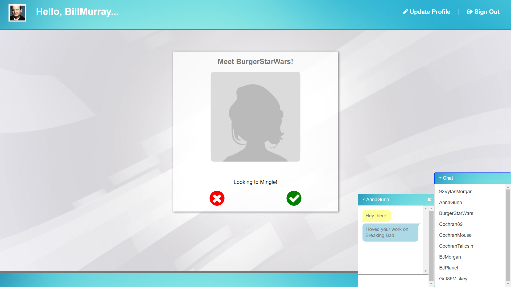
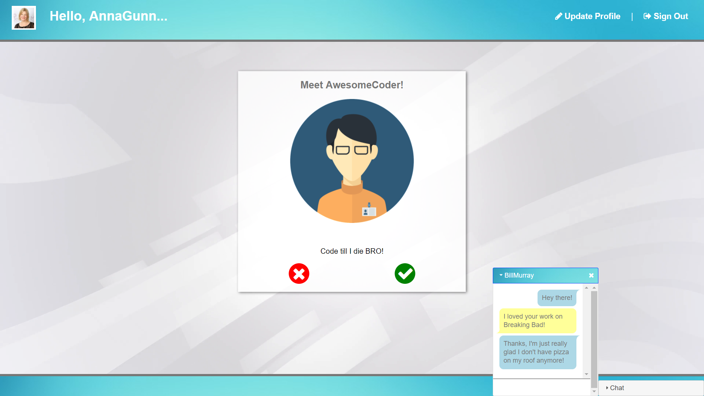
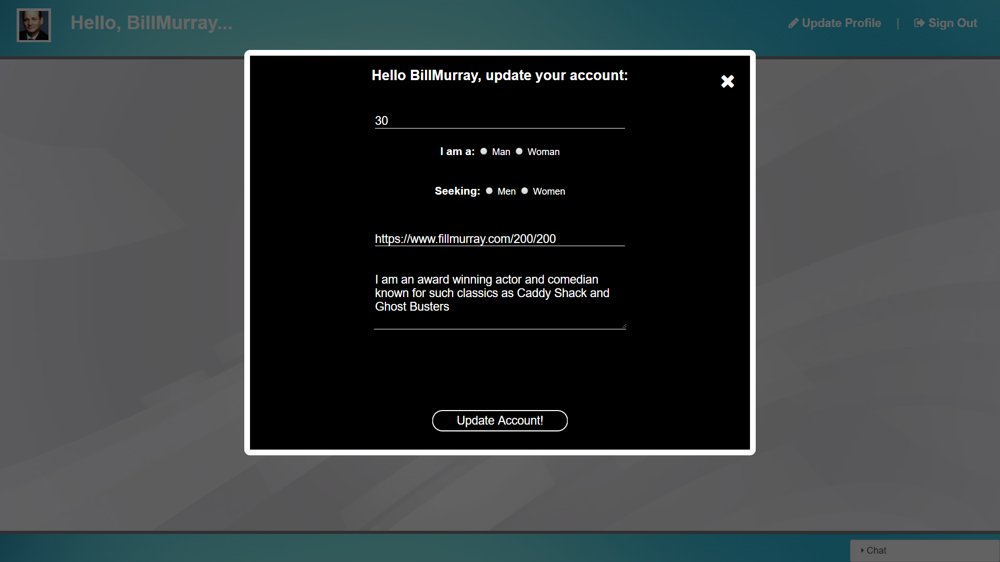

# Sweet-Talk!
## A speed dating application where users can meet people based on matching criteria, and chat with them one-on-one.

## To view a live version of this app, [click here.](https://map-sweet-talk.herokuapp.com/)

## Technologies used:
* Node.js
* Express
* Socket.io
* Passport.js
* MongoDB
* Mongoose
* Handlebars
* Javascript
* jQuerymark
* HTML5
* CSS3

#### Future plans include adding video chat with WebRTC.

## Sweet talk users are greeted with a warm and inviting landing page, where they have the option of logging in if they are a return user, or creating a new account:

## When the 'create account' link is clicked, a modal is opened allowing a user to input their personal details and preferences:

## All input fields are fully validated.  When a user input doesn't match the necessary standard, the underline turns red and an error message is shown:

## When a user successfully creates an account, they are automatically redirected to the login screen with their username and password entered:

## Once the user is successfully logged in, they are greeted with pictures and bios of their potential matches.  They can click 'yes' or 'no' on them and cycle through the matches:

## If a person they click 'yes' to likes them as well, their names will appear in their list of potential chat partners and they can initiate a chat session:

## If a user would like to, they are capable of updating any of their profile infomation by clicking on the 'update profile' link.  A modal will open and they can update their information in the database:

